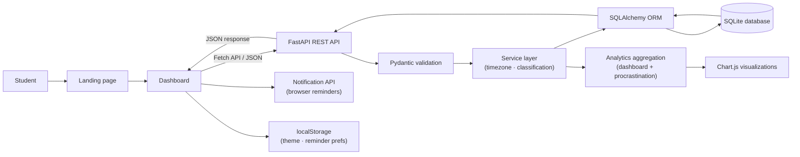

# Zejora

> **Study smarter. Beat procrastination. Own your semester.**

Zejora is a full-stack academic productivity platform built for students who need one reliable place to organize subjects, coursework, assignments, and deadlines. Beyond simple task management, it tracks behavioral patterns, surfaces procrastination insights, delivers browser deadline reminders, and visualizes workload through live analytics — all in a clean, distraction-free interface.

Built with **FastAPI**, **SQLAlchemy**, and **SQLite** on the backend, and a pure **HTML, CSS, and Vanilla JavaScript** frontend with no framework dependencies.

---

## Table of Contents

- [Why Zejora](#why-zejora)
- [Feature Overview](#feature-overview)
- [Screenshots](#screenshots)
- [Architecture](#architecture)
- [Technology Stack](#technology-stack)
- [Data Model](#data-model)
- [Deadline Intelligence](#deadline-intelligence)
- [Procrastination Analysis System](#procrastination-analysis-system)
- [API Reference](#api-reference)
- [Analytics](#analytics)
- [Project Structure](#project-structure)
- [Getting Started](#getting-started)
- [Testing](#testing)
- [Design System](#design-system)
- [Engineering Decisions](#engineering-decisions)

---

## Why Zejora

Students juggle five subjects across disconnected portals, group chats, calendars, and notes. Assignments slip through the cracks. Deadlines appear out of nowhere. The real problem is not a lack of tools — it is a lack of one coherent system.

Zejora is built around four principles:

1. **Organize by subject** — every task has a clear academic context.
2. **Make deadlines visible** — Today, Upcoming, Urgent, and Overdue views prevent surprises.
3. **Understand your behavior** — procrastination scoring and delay analytics help students recognize patterns, not just symptoms.
4. **Act on insight** — personalised recommendations and browser reminders turn data into changed habits.

---

## Feature Overview

### Subject Management
- Create, rename, recolor, and delete academic subjects (Data Structures, Cybersecurity, AI, Mathematics, Software Engineering, etc.)
- Each subject acts as a container for related tasks and assignments
- Task counts displayed per subject in the sidebar
- Confirmation-gated cascade deletion when a subject still contains tasks
- Case-insensitive uniqueness enforcement

### Task Management
- Create tasks with title, description, subject, due date and time, priority (Low / Medium / High), and estimated study hours
- Edit and delete tasks without page reloads
- Mark tasks complete or reopen them at any time
- Completion timestamps recorded automatically for behavioral analytics
- `postpone_count` tracked automatically every time a task's deadline is moved
- Full-text search across title, description, and subject name
- Filter by status (Pending, Urgent, Overdue, Done) and priority simultaneously

### Smart Deadline Tracking
- Tasks automatically classified as **Completed**, **Urgent**, **Overdue**, or **Pending** based on current time
- Dashboard grouped into **Today**, **Overdue**, **Upcoming**, **Later**, and **Completed** sections
- Urgent tasks highlighted amber, overdue tasks highlighted red, completed tasks shown in green
- Timezone-aware: Today and Upcoming windows use the browser's local timezone

### Procrastination Analysis System
- Procrastination score (0–100) with categories: Excellent, Good, Moderate, Serious, Chronic Procrastinator
- Average delay days, overdue percentage, and average postponement count
- Per-subject delay breakdown — identifies which subjects students avoid most
- Per-priority delay analysis — reveals whether low-priority tasks slip furthest
- 8-week weekly overdue trend chart
- Warning banners for frequently avoided subjects (≥30% overdue rate)
- Top 5 most-postponed tasks with postponement counts
- Personalised, data-driven recommendations generated automatically

### Browser Deadline Reminder System
- Requests browser notification permission on first dashboard visit
- Background check runs on a configurable interval (1 min to 30 min)
- Notifies for tasks due within 24 hours, within 1 hour, and overdue tasks
- Notifications include task title, subject name, remaining time, and motivational message
- Reminder settings panel: enable/disable per alert type, adjust interval
- Preferences stored in `localStorage` and persist across sessions

### Live Analytics Dashboard (Chart.js)
- Pie / doughnut chart: task status distribution (Completed / Pending / Overdue)
- Bar chart: workload distribution by subject
- Line chart: 8-week task completion trend
- Doughnut chart: priority distribution (High / Medium / Low)
- Productivity score card (completion rate minus overdue penalty)
- All charts update dynamically after every task or subject change

### Calendar View
- Monthly calendar showing tasks by due date
- Color-coded dots per subject on each day cell
- Overdue and urgent indicator borders on affected days
- Click any date to view a task panel for that day
- Month navigation with previous/next controls

### Study Insights
- Productivity score with labeled performance level
- Most active subject (highest task count)
- Tasks completed this week

### Dark Mode
- Full dark theme across landing page and dashboard
- Toggle in the sidebar or header
- Preference persisted in `localStorage`
- Charts re-render automatically on theme change

### UX Polish
- Polished landing page with hero section, feature cards, analytics showcase, testimonials, and call-to-action
- Responsive layout for desktop, tablet, and mobile
- Toast notifications for all user actions
- Native `<dialog>` modals for forms and confirmations
- Empty states, form validation, and graceful error feedback
- `prefers-reduced-motion` support throughout

---

## Screenshots

| Landing page | Dashboard |
|---|---|
| Hero section, features, analytics preview, testimonials | Tasks, subjects, calendar, charts, procrastination insights |

*Run the app locally to see the full experience.*

---

## Architecture



### Request flow

1. Student performs an action on the dashboard.
2. Vanilla JavaScript sends a JSON request via the Fetch API.
3. FastAPI routes the request; Pydantic validates the body.
4. The service layer applies timezone normalization and task-state rules.
5. SQLAlchemy reads or writes the appropriate SQLite records.
6. FastAPI returns a structured JSON response.
7. JavaScript updates tasks, counters, subjects, and charts in-place.
8. The notification service checks deadlines in the background and fires browser alerts.

---

## Technology Stack

| Layer | Technology | Purpose |
|---|---|---|
| Backend | Python 3.11+, FastAPI | REST endpoints, business logic, auto-generated API docs |
| Validation | Pydantic v2 | Typed request/response contracts with field-level validation |
| ORM | SQLAlchemy 2 | Models, relationships, queries, and session management |
| Database | SQLite | Serverless local persistence with foreign-key enforcement |
| Server | Uvicorn | ASGI development server |
| Frontend | HTML5 | Semantic structure for landing page and dashboard |
| Styling | CSS3 | Design tokens, responsive layouts, animations, dark mode |
| UI logic | Vanilla JavaScript | Fetch, DOM updates, state, dialogs, charts, notifications |
| Visualization | Chart.js 4 | Status, workload, completion-trend, and procrastination charts |
| Testing | Pytest, HTTPX | API and business-logic test suite |

---

## Data Model

### Subject

| Field | Type | Description |
|---|---|---|
| `id` | Integer PK | Auto-incremented primary key |
| `name` | String(80) | Case-insensitively unique subject name |
| `color` | String(7) | Hex color used in sidebar, charts, and task cards |
| `created_at` | DateTime | Automatic creation timestamp |
| `updated_at` | DateTime | Automatic update timestamp |

### Task

| Field | Type | Description |
|---|---|---|
| `id` | Integer PK | Auto-incremented primary key |
| `title` | String(140) | Required task title |
| `description` | Text | Optional supporting details |
| `subject_id` | FK → Subject | Owning subject; cascade-deletes with subject |
| `due_at` | DateTime | Required deadline stored as UTC |
| `priority` | String | `low`, `medium`, or `high` |
| `completed` | Boolean | Current completion flag |
| `estimated_hours` | Float | Optional study-time estimate |
| `postpone_count` | Integer | Auto-incremented each time `due_at` changes on an incomplete task |
| `completed_at` | DateTime | Set when task is marked complete; cleared on reopen |
| `created_at` | DateTime | Automatic creation timestamp |
| `updated_at` | DateTime | Automatic update timestamp |

Deleting a subject with tasks returns a `409` conflict with the task count unless `?cascade=true` is explicitly passed.

---

## Deadline Intelligence

Task states are computed dynamically from the current time — never stored as stale columns:

| State | Rule |
|---|---|
| **Completed** | `completed = true` |
| **Overdue** | `completed = false` and `due_at < now` |
| **Urgent** | `completed = false` and `now ≤ due_at ≤ now + 24h` |
| **Pending** | `completed = false` and `due_at > now + 24h` |

Calendar grouping works relative to the student's local timezone:

| Group | Window |
|---|---|
| **Today** | Current local calendar day |
| **Upcoming** | Next 7 local calendar days |
| **Later** | Beyond 7 days |
| **Overdue** | Past deadline, incomplete |
| **Completed** | Finished, sorted by `completed_at` descending |

---

## Procrastination Analysis System

The `/api/analytics/procrastination` endpoint aggregates behavioral signals and returns:

### Scoring

```
procrastination_score = (overdue_% × 0.45) + (avg_delay_days/14 × 30) + (avg_postpone/5 × 25)
```

Clamped to 0–100. Category thresholds:

| Score | Category |
|---|---|
| 0–20 | Excellent |
| 21–40 | Good |
| 41–60 | Moderate |
| 61–80 | Serious |
| 81–100 | Chronic Procrastinator |

### Metrics returned

| Metric | Description |
|---|---|
| `score` | Composite procrastination score 0–100 |
| `category` | Human-readable performance category |
| `avg_delay_days` | Average days late across completed tasks |
| `overdue_percentage` | Percentage of all tasks currently overdue |
| `avg_postpone_count` | Average number of deadline changes per task |
| `subject_delays` | Per-subject avg delay, overdue count, overdue rate |
| `priority_delays` | Avg delay broken down by High / Medium / Low priority |
| `weekly_overdue` | 8-week overdue count + rate trend |
| `frequently_avoided` | Subjects with ≥30% overdue rate |
| `most_postponed_tasks` | Top 5 tasks by postpone count |
| `recommendations` | Personalised advice strings generated from the data |

### Postponement tracking

Every time a PATCH request changes `due_at` on an incomplete task, the backend automatically increments `postpone_count`. No client-side action required.

---

## API Reference

Full interactive documentation: `http://127.0.0.1:8000/docs`
ReDoc reference: `http://127.0.0.1:8000/redoc`

### System

| Method | Endpoint | Description |
|---|---|---|
| `GET` | `/api/health` | API health check |

### Subjects

| Method | Endpoint | Description |
|---|---|---|
| `GET` | `/api/subjects` | List all subjects with task counts |
| `POST` | `/api/subjects` | Create a subject |
| `GET` | `/api/subjects/{id}` | Get one subject |
| `PATCH` | `/api/subjects/{id}` | Rename or recolor a subject |
| `DELETE` | `/api/subjects/{id}` | Delete empty subject |
| `DELETE` | `/api/subjects/{id}?cascade=true` | Delete subject and all its tasks |

### Tasks

| Method | Endpoint | Description |
|---|---|---|
| `GET` | `/api/tasks` | List tasks (filter: `subject_id`, `completed`, `priority`, `search`, `sort_by`, `sort_dir`) |
| `POST` | `/api/tasks` | Create a task |
| `GET` | `/api/tasks/{id}` | Get one task |
| `PATCH` | `/api/tasks/{id}` | Edit task fields or toggle completion |
| `DELETE` | `/api/tasks/{id}` | Delete a task |
| `GET` | `/api/tasks/due/today` | Tasks due today (accepts `timezone`) |
| `GET` | `/api/tasks/due/upcoming` | Tasks due in the next 7 days (accepts `timezone`) |
| `GET` | `/api/tasks/due/overdue` | Incomplete tasks past their deadline |

### Analytics

| Method | Endpoint | Description |
|---|---|---|
| `GET` | `/api/analytics/dashboard` | Summary stats, status/priority/workload distributions, 8-week trend |
| `GET` | `/api/analytics/procrastination` | Full procrastination report with scores, delays, trends, and recommendations |

---

## Analytics

### Dashboard analytics (`/api/analytics/dashboard`)

| Dataset | Contents |
|---|---|
| `summary` | total, completed, pending, overdue, urgent, due_today, due_next_7_days, completion_rate |
| `status_distribution` | completed / pending / overdue counts for the doughnut chart |
| `priority_distribution` | high / medium / low counts |
| `subject_workload` | task counts and colors per subject for the bar chart |
| `weekly_completion` | 8 weekly buckets of `completed_at` timestamps for the trend line |
| `study_insights` | productivity_score, tasks_this_week |

### Procrastination analytics (`/api/analytics/procrastination`)

See [Procrastination Analysis System](#procrastination-analysis-system) above.

---

## Project Structure

```text
zejora/
├── app/
│   ├── __init__.py
│   ├── database.py          # Engine, session factory, foreign-key pragma
│   ├── main.py              # FastAPI routes, analytics queries, procrastination endpoint
│   ├── models.py            # SQLAlchemy Subject and Task models
│   ├── schemas.py           # Pydantic request/response contracts + analytics schemas
│   └── services.py          # UTC helpers, timezone conversion, task classification
├── static/
│   ├── css/
│   │   └── styles.css       # Full design system: tokens, components, dark mode, responsive
│   ├── js/
│   │   ├── dashboard.js     # State, CRUD, charts, calendar, notifications, procrastination
│   │   └── landing.js       # Reveal-on-scroll intersection observer
│   ├── dashboard.html       # Dashboard shell with all panels and modals
│   └── index.html           # Marketing landing page
├── tests/
│   ├── conftest.py          # Isolated in-memory SQLite test setup
│   └── test_api.py          # API and business-rule test suite
├── requirements.txt
└── README.md
```

---

## Getting Started

### Prerequisites

- Python 3.11 or newer
- `pip`
- A modern browser with JavaScript and notifications enabled

### Windows (PowerShell)

```powershell
py -m venv .venv
.\.venv\Scripts\Activate.ps1
pip install -r requirements.txt
python -m uvicorn app.main:app --reload
```

### macOS / Linux

```bash
python3 -m venv .venv
source .venv/bin/activate
pip install -r requirements.txt
python -m uvicorn app.main:app --reload
```

### Open in browser

| URL | Page |
|---|---|
| `http://127.0.0.1:8000/` | Landing page |
| `http://127.0.0.1:8000/dashboard` | Dashboard |
| `http://127.0.0.1:8000/docs` | Swagger UI (interactive API docs) |
| `http://127.0.0.1:8000/redoc` | ReDoc reference |

The `zejora.db` SQLite file is created automatically in the project root on first startup.

---

## Testing

```powershell
python -m pytest -q
```

The test suite covers:

- Health and page responses
- Subject CRUD and case-insensitive uniqueness
- Task CRUD and subject relationships
- Completion and reopening state transitions
- Invalid priorities, missing subjects, and timezone-naive dates
- Urgent and overdue state classification
- Today, upcoming, and overdue collections
- Cascade deletion confirmation behavior
- Dashboard analytics and 8-week completion aggregation

Tests use an isolated in-memory SQLite database. Local `zejora.db` data is never touched.

---

## Design System

Zejora blends digital minimalism with a warm, student-lifestyle aesthetic:

| Token | Value | Usage |
|---|---|---|
| `--paper` | `#FDFCF8` | Page background (light) |
| `--ink` | `#292524` | Primary text and dark surfaces |
| `--coral` | `#FFB7B2` | Primary accent — CTA buttons, urgent highlights |
| `--sage` | `#E8EFE8` | Completed state, calm sections |
| `--lavender` | `#EFEDF4` | Secondary accent — priority doughnut, modals |
| `--yellow` | `#F8E6A6` | Urgent state badges |
| `--red` | `#F4C8C5` | Overdue state, error surfaces |

**Typography:** Outfit (interface) + Reenie Beanie (script accents)

**Surfaces:** generous border-radius, restrained drop shadows, SVG grain overlay for paper texture

**Motion:** reveal-on-scroll sections, floating blob decorations, smooth chart transitions, `prefers-reduced-motion` respected throughout

---

## Engineering Decisions

### Backend-owned state classification
Deadline states (urgent, overdue, pending) are computed in Python at query time rather than stored as columns. This ensures every client — API consumer, dashboard, tests — receives the same interpretation and eliminates stale status drift.

### Behavioral postponement tracking
`postpone_count` is incremented server-side whenever `due_at` changes on an incomplete task. The client never sends this value, preventing manipulation and ensuring trustworthy procrastination metrics.

### Analytics-first API design
Both analytics endpoints return chart-ready, aggregated JSON. Chart.js handles only rendering. Business logic (delay calculations, score formulas, recommendation generation) stays in Python where it can be tested independently.

### Framework-free frontend
Vanilla JavaScript keeps the client lightweight and directly demonstrates control of browser APIs — Fetch, Notification, `localStorage`, `<dialog>`, IntersectionObserver, and Chart.js — without a build step or bundler.

### Explicit cascade deletion
Deleting a populated subject requires a second request with `?cascade=true`. The first response exposes the task count so the frontend can present an informed confirmation before any data is lost.

### Portable SQLite persistence
No separate database server required. SQLite provides full relational integrity (foreign keys enforced via `PRAGMA foreign_keys=ON`) in a single file, making Zejora easy to run for development, coursework, and demonstrations.

---

**Zejora** — one calm system for every assignment, deadline, and study habit that shapes your semester.
