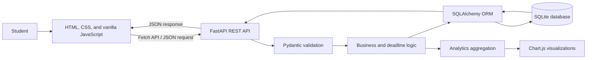

# Zejora

> **Study. Organize. Achieve more.**
>
> One system for a calmer, clearer academic life.

Zejora is a full-stack campus task manager built for students who need one reliable place to organize subjects, coursework, assignments, and deadlines. It combines structured task management with time-aware prioritization and live productivity analytics, while keeping the experience lightweight, responsive, and easy to understand.

The project uses **FastAPI**, **SQLAlchemy**, and **SQLite** on the backend, with a pure **HTML, CSS, and vanilla JavaScript** frontend. There is no frontend framework: all interactions use the browser Fetch API and update the interface without page reloads.

## Table of Contents

- [Why Zejora](#why-zejora)
- [Core Features](#core-features)
- [Product Experience](#product-experience)
- [Architecture](#architecture)
- [Technology Stack](#technology-stack)
- [Data Model](#data-model)
- [Deadline Intelligence](#deadline-intelligence)
- [API Reference](#api-reference)
- [Analytics](#analytics)
- [Project Structure](#project-structure)
- [Getting Started](#getting-started)
- [Testing](#testing)
- [Design System](#design-system)
- [Engineering Decisions](#engineering-decisions)
- [Future Improvements](#future-improvements)

## Why Zejora

Students often manage several subjects through disconnected learning portals, chat groups, calendars, notes, and mental reminders. This makes it easy to lose track of an assignment, underestimate an approaching deadline, or miss the larger pattern in an academic workload.

Zejora addresses that problem through four principles:

1. **Organize by subject** so every academic task has a clear context.
2. **Make deadlines visible** through Today, Upcoming, Overdue, and Urgent classifications.
3. **Reduce interface noise** so students can focus on the next meaningful action.
4. **Turn activity into insight** through workload and completion analytics.

The goal is not to add another complicated planning system. Zejora is designed to feel like an academic command center that is simple, focused, and supportive.

## Core Features

### Subject management

- Create, view, rename, recolor, and delete academic subjects.
- Use subjects as containers for related assignments and study tasks.
- Filter the dashboard to a single subject using focus mode.
- Prevent accidental data loss by requiring explicit confirmation before deleting a subject with tasks.
- Enforce case-insensitive subject-name uniqueness.

### Task management

- Create tasks with a title, optional description, subject, due date and time, and priority.
- Edit and delete tasks without reloading the page.
- Mark tasks complete or reopen them later.
- Record completion timestamps for historical analytics.
- Display low, medium, and high priority badges.

### Smart deadline tracking

- Group work into **Today**, **Upcoming**, **Overdue**, **Later**, and **Completed** sections.
- Highlight tasks due within 24 hours as urgent.
- Highlight incomplete tasks past their deadline as overdue.
- Interpret Today and Upcoming windows using the browser's local timezone.
- Store normalized timestamps consistently in the database.

### Live analytics

- Show total, completed, pending, overdue, urgent, and due-today counts.
- Calculate the overall completion rate.
- Visualize task status with a doughnut chart.
- Compare workload across subjects with a bar chart.
- Display completion momentum over the previous eight weeks with a line chart.
- Refresh all charts after task creation, editing, completion, reopening, or deletion.

### Responsive experience

- Provide separate landing and dashboard pages.
- Support desktop, tablet, and mobile layouts.
- Use reusable native dialogs for task and subject forms.
- Include loading-safe API handling, validation messages, empty states, and toast feedback.
- Respect keyboard focus and `prefers-reduced-motion` settings.

## Product Experience

### Landing page

The landing page introduces Zejora as a student-focused productivity tool. It explains the problem of scattered coursework, presents the core value proposition, previews the dashboard, highlights key features, and directs the student to get started.

### Dashboard

The dashboard is the working center of the application:

- The left sidebar lists subjects and activates subject focus mode.
- Summary cards show immediate workload indicators.
- Tasks are grouped by their relationship to the current date.
- Each task card supports completion, editing, and deletion.
- The analytics section translates current and historical task data into visual insights.

The dashboard behaves like a lightweight single-page application even though it is implemented with framework-free JavaScript.

## Architecture



### Request flow

1. A student performs an action in the dashboard.
2. Vanilla JavaScript sends a JSON request through the Fetch API.
3. FastAPI routes the request and Pydantic validates its data.
4. The service layer applies timezone and task-state rules.
5. SQLAlchemy reads or writes the corresponding SQLite records.
6. FastAPI returns a structured JSON response.
7. The frontend updates tasks, counters, subjects, and charts without reloading.

## Technology Stack

| Layer | Technology | Purpose |
|---|---|---|
| Backend | Python, FastAPI | REST endpoints, business logic, automatic API documentation |
| Validation | Pydantic | Typed request and response validation |
| ORM | SQLAlchemy 2 | Models, relationships, queries, and database interactions |
| Database | SQLite | Lightweight, serverless local persistence |
| Server | Uvicorn | ASGI development server |
| Frontend | HTML5 | Semantic landing page and dashboard structure |
| Styling | CSS3 | Responsive layouts, design tokens, animations, and component styling |
| UI logic | Vanilla JavaScript | Fetch requests, dialogs, filtering, rendering, and state synchronization |
| Visualization | Chart.js | Status, workload, and completion-trend charts |
| Testing | Pytest, HTTPX | API and business-logic verification |

## Data Model

Zejora deliberately uses two core entities to keep the academic domain easy to reason about.

### Subject

| Field | Description |
|---|---|
| `id` | Primary key |
| `name` | Case-insensitively unique subject name |
| `color` | Hex color used throughout the dashboard and charts |
| `created_at` | Automatic creation timestamp |
| `updated_at` | Automatic update timestamp |

### Task

| Field | Description |
|---|---|
| `id` | Primary key |
| `title` | Required task title |
| `description` | Optional supporting details |
| `subject_id` | Foreign key linking the task to a subject |
| `due_at` | Required deadline normalized for storage |
| `priority` | `low`, `medium`, or `high` |
| `completed` | Current completion state |
| `completed_at` | Timestamp used for completion analytics |
| `created_at` | Automatic creation timestamp |
| `updated_at` | Automatic update timestamp |

Deleting a subject can cascade to its tasks, but the API first returns a conflict containing the affected task count unless the client explicitly confirms cascade deletion.

## Deadline Intelligence

Task states are computed from the current time rather than stored as duplicated database values:

| State | Rule |
|---|---|
| **Completed** | The task's completion flag is true |
| **Overdue** | The task is incomplete and its due time has passed |
| **Urgent** | The task is incomplete and due within the next 24 hours |
| **Pending** | The task is incomplete, not overdue, and more than 24 hours away |

Calendar groups add another useful perspective:

- **Today** uses the student's local calendar day.
- **Upcoming** covers the following seven calendar days.
- **Later** contains incomplete work outside those windows.
- **Completed** keeps finished work available for review and analytics.

This separation avoids stale status columns and ensures consistent results across the API and dashboard.

## API Reference

FastAPI also generates interactive documentation at `/docs` and a ReDoc reference at `/redoc`.

### System

| Method | Endpoint | Description |
|---|---|---|
| `GET` | `/api/health` | Return API and product health information |

### Subjects

| Method | Endpoint | Description |
|---|---|---|
| `GET` | `/api/subjects` | List subjects with task counts |
| `POST` | `/api/subjects` | Create a subject |
| `GET` | `/api/subjects/{subject_id}` | Retrieve one subject |
| `PATCH` | `/api/subjects/{subject_id}` | Update a subject |
| `DELETE` | `/api/subjects/{subject_id}` | Delete an empty subject |
| `DELETE` | `/api/subjects/{subject_id}?cascade=true` | Confirm deletion of a subject and its tasks |

### Tasks

| Method | Endpoint | Description |
|---|---|---|
| `GET` | `/api/tasks` | List tasks, optionally filtered by subject or completion state |
| `POST` | `/api/tasks` | Create a task |
| `GET` | `/api/tasks/{task_id}` | Retrieve one task |
| `PATCH` | `/api/tasks/{task_id}` | Edit task details or completion state |
| `DELETE` | `/api/tasks/{task_id}` | Delete a task |
| `GET` | `/api/tasks/due/today` | List tasks due on the local calendar day |
| `GET` | `/api/tasks/due/upcoming` | List tasks due in the next seven calendar days |
| `GET` | `/api/tasks/due/overdue` | List incomplete tasks past their deadline |

The Today and Upcoming endpoints accept a `timezone` query parameter such as `Asia/Kuala_Lumpur`.

### Analytics

| Method | Endpoint | Description |
|---|---|---|
| `GET` | `/api/analytics/dashboard` | Return summary statistics, status distribution, subject workload, and eight-week completion history |

## Analytics

The analytics endpoint returns four coordinated datasets:

1. **Summary**: total tasks, completed, pending, overdue, urgent, due today, due within seven days, and completion rate.
2. **Status distribution**: completed, pending, and overdue values for the doughnut chart.
3. **Subject workload**: task counts and colors for each subject.
4. **Weekly completion**: eight weekly buckets derived from `completed_at` timestamps.

Charts are presentation-only. Classification and aggregation are performed by the backend so every client receives the same interpretation of the underlying task data.

## Project Structure

```text
zejora/
├── app/
│   ├── __init__.py
│   ├── database.py       # Engine, session factory, and SQLite configuration
│   ├── main.py           # FastAPI routes, page serving, and analytics queries
│   ├── models.py         # SQLAlchemy Subject and Task models
│   ├── schemas.py        # Pydantic request and response contracts
│   └── services.py       # Timezone conversion and task classification
├── static/
│   ├── css/
│   │   └── styles.css    # Shared responsive design system
│   ├── js/
│   │   ├── dashboard.js  # Dashboard state, CRUD actions, and Chart.js updates
│   │   └── landing.js    # Reveal-on-scroll behavior
│   ├── dashboard.html
│   └── index.html
├── tests/
│   ├── conftest.py       # Isolated temporary SQLite test setup
│   └── test_api.py       # API and business-rule tests
├── requirements.txt
└── README.md
```

## Getting Started

### Prerequisites

- Python 3.11 or newer
- `pip`
- A modern browser with JavaScript enabled

### Windows PowerShell

```powershell
py -m venv .venv
.\.venv\Scripts\Activate.ps1
python -m pip install -r requirements.txt
python -m uvicorn app.main:app --reload
```

### macOS or Linux

```bash
python3 -m venv .venv
source .venv/bin/activate
python -m pip install -r requirements.txt
python -m uvicorn app.main:app --reload
```

Open the following URLs:

- Landing page: `http://127.0.0.1:8000/`
- Dashboard: `http://127.0.0.1:8000/dashboard`
- Swagger UI: `http://127.0.0.1:8000/docs`
- ReDoc: `http://127.0.0.1:8000/redoc`

The `zejora.db` SQLite database is created automatically in the project root on first startup.

## Testing

Run the complete test suite from the project root:

```powershell
python -m pytest -q
```

The current suite covers:

- Health and frontend page responses
- Subject CRUD and case-insensitive uniqueness
- Task CRUD and subject relationships
- Completion and reopening transitions
- Invalid priorities, subjects, and timezone-naive dates
- Urgent and overdue classification
- Today, upcoming, and overdue collections
- Explicit cascade deletion behavior
- Dashboard analytics and eight-week completion aggregation

Tests use a temporary SQLite database, leaving local Zejora data untouched.

## Design System

Zejora combines digital minimalism with a friendly student-lifestyle aesthetic.

- **Background:** warm paper white `#FDFCF8`
- **Text:** soft black `#292524`
- **Primary accent:** coral `#FFB7B2`
- **Supporting colors:** sage and lavender
- **Typography:** Outfit for interface text and Reenie Beanie for expressive accents
- **Surfaces:** generous rounded corners and restrained shadows
- **Texture:** a fixed SVG grain overlay for a paper-like finish
- **Motion:** reveal-on-scroll sections and gently floating decorative blobs

Task states are communicated with both labels and color:

- Urgent: yellow
- Overdue: red
- Completed: green

## Engineering Decisions

### Two-entity domain model

Subjects and Tasks capture the core workflow without unnecessary complexity. Subjects provide academic context, while tasks contain actionable work and deadlines.

### Backend-owned time rules

Deadline classification and analytics are calculated centrally in Python. This avoids different clients interpreting urgent or overdue work differently.

### Analytics-first API design

The frontend receives chart-ready data from one dedicated endpoint. Chart.js remains focused on rendering instead of duplicating business logic.

### Framework-free frontend

Vanilla JavaScript keeps the client lightweight and demonstrates direct control of browser APIs, DOM rendering, native dialogs, and Fetch-based state updates.

### Explicit destructive actions

Deleting a populated subject requires a second request with `cascade=true`. The first response exposes the affected task count so the interface can present an informed confirmation.

### Portable local storage

SQLite provides relational integrity without requiring a separate database server, making Zejora easy to run for demonstrations, coursework, and hackathons.

## Future Improvements

The current application is intentionally a local, single-student system. Logical future extensions include:

- User authentication and per-user data ownership
- email deadline reminders
- Alembic-managed database migrations
- Calendar and learning-management-system integrations
- Study-session or Pomodoro tracking
- Offline support through a service worker
- Import and export for coursework data
- Deployment configuration for a hosted production environment

These are roadmap ideas and are not part of the current implementation.

---

**Zejora** turns scattered academic responsibilities into one clear system: plan today, focus on what matters, and understand your progress over time.
